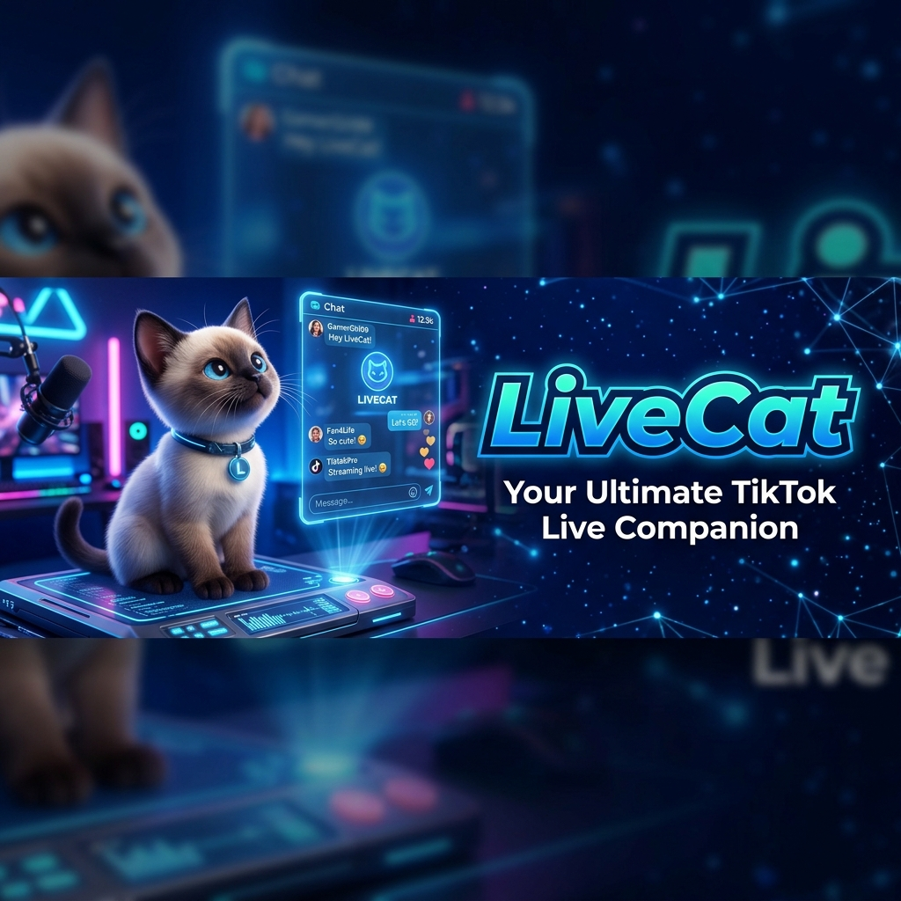

# LiveCat 🐱 - TikTok LIVE Chat Reader


[](https://github.com/JJacKTH/LiveCat/releases/latest)



**LiveCat** is a professional, cute, and high-performance Windows application designed for TikTok streamers. It allows you to read your LIVE chat, gifts, joins, and likes in real-time with built-in Text-to-Speech (TTS) and a customizable overlay for OBS/TikTok Live Studio.

## ✨ Features

- 🚀 **Real-time Connectivity**: Just enter your @username and connect instantly.
- 💬 **Smart Chat Feed**: Beautifully categorized events (Chat, Gifts, Likes, Joins, Follows).
- 🔊 **Thai TTS**: Automated queue-based voice assistant for reading comments and gift thanks.
- 🖼️ **Stream Overlay**: Separate transparent window with Green Screen support for easy capture.
- 📦 **Portable & Installer**: Choose between a standard installation or a single portable .exe.
- 🎨 **Premium UI**: Modern dark theme with smooth animations and glassmorphism.

## 🚀 Quick Start

### Installation
1. Download the latest version from the [Releases](https://github.com/JJacKTH/LiveCat/releases) page.
   - `LiveCat Setup 1.0.0.exe` (Installer)
   - `LiveCat 1.0.0.exe` (Portable)
2. Run the application.
3. Enter your TikTok username (e.g., `@mychannel`).
4. Click **Connect**.

### Using with TikTok Live Studio / OBS
1. Open the **Overlay Window** using the monitor icon in LiveCat.
2. In your streaming software (OBS or TikTok Live Studio), add a new **Window Capture** source.
3. Select the `LiveCat - Overlay` window.
4. If using the Green Screen, add a **Chroma Key** filter to remove the green background (#00FF00).

## 🛠️ Development Setup

```bash
# Clone the repository
git clone https://github.com/USERNAME/livecat.git
cd livecat

# Install dependencies
npm install

# Run in development mode
npm run dev

# Build Installer
npm run dist:win

# Build Portable Version
npm run portable
```

## ⚠️ Limitations & Security

- **Unofficial API**: This project uses the [tiktok-live-connector](https://github.com/zerodytrash/TikTok-Live-Connector) library. It is not an official TikTok product.
- **Protocol Changes**: If TikTok updates their system, this app may require an update to continue working.
- **Privacy**: LiveCat does **not** require your password. It only uses your public username to join the live stream as a viewer.

## 🛠️ Troubleshooting

- **Connection Failed**: Ensure your stream is actually LIVE before connecting.
- **TTS Not Working**: Check if your system has Thai voices installed (Settings > Time & Language > Speech).
- **Overlay Transparent Issue**: In OBS, ensure "Capture Method" is set to "Windows 10" or "BitBlt" if transparency isn't working correctly.

---

### 🐱 Join the Community
Follow for updates and report bugs on the [GitHub Issues](https://github.com/JJacKTH/livecat/issues) page.

```bash
git init
git add .
git commit -m "Initial commit: LiveCat TikTok LIVE chat reader"
git branch -M main
git remote add origin https://github.com/JJacKTH/livecat.git
git push -u origin main
```
